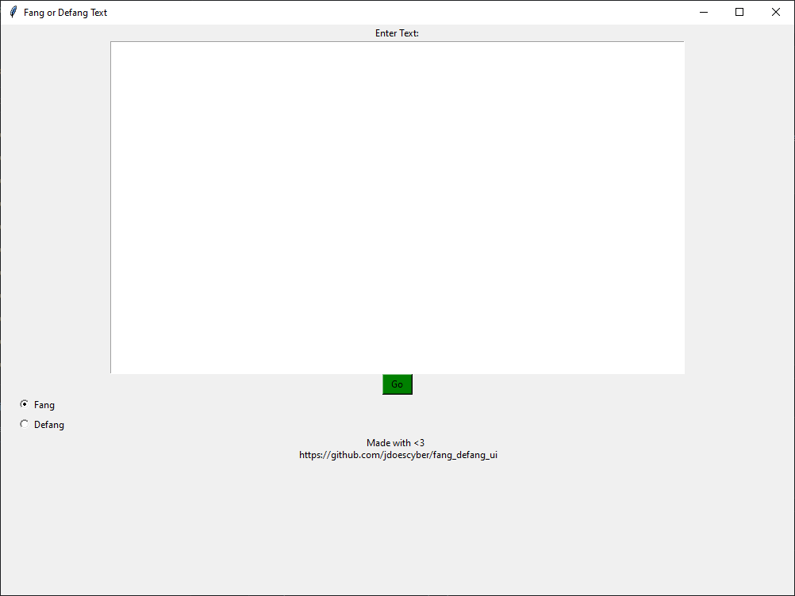

[fang_defang_ui](https://github.com/jdoescyber/fang_defang_ui) is a very simple Python GUI which allows an analyst to quickly fang or defang artifacts.

This project was born out of a desire to handle IOCs that are collected with different formats: some threat reports will be fanged, others will be defanged. Instead of `CTRL + F`ing my way through it, I decided to write a Python script. The script originally took a file path (a text file, typically) and then converted the contents of that file.

Shortly thereafter, a fellow analyst asked if I had a GUI for it. I didn't, so I built one. This is the GUI that exists today.

❗ - To be very clear, this project was made possible by the folks that maintain the `ioc_fanger` Python module.

  

